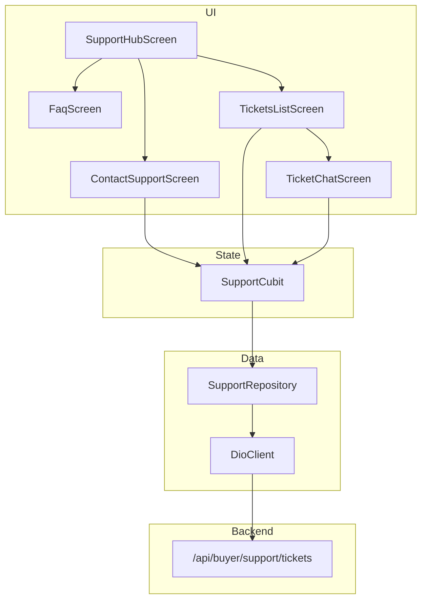

# Support Features — API Integration Plan

You're in good shape: **5 support screens are built with mock data**, and the networking foundation (`DioClient`, endpoints, interceptors) already exists. What's left is the data layer and wiring screens to the same backend the website uses — via JSON API routes instead of HTML forms.

> **Note on `docs/naheed-private/`:** It's in `.gitignore`, so it won't show up in git or for me. Use it locally for your personal notes; this plan is the shared reference.

---

## Current State Summary

| Screen | Status | API needed? |
|--------|--------|-------------|
| Support Hub | Done (static + `url_launcher`) | No |
| FAQ | Done (static `kFaqData`) | No |
| Contact Support | UI done, mock submit | **Yes** — create ticket |
| My Tickets | UI done, mock list | **Yes** — list tickets |
| Ticket Chat | UI done, mock messages + fake agent reply | **Yes** — get/send messages + polling |
| Parcel Tracking (SP8) | Not built yet | Yes — separate endpoint |

**Missing data layer:**
- `lib/features/support/data/support_repository.dart`
- `lib/features/support/presentation/cubits/support_cubit.dart` + `support_state.dart`
- JSON serialization on models

**Foundation gap:** `DioClient().init()` is not called in `main.dart` yet. Coordinate with **Arwah** (networking owner) before wiring real calls — or you can add it yourself since you're project lead.

---

## Website vs App — Key Differences

The website and app hit the **same backend**, but differently:

| | Website | Android App |
|---|---------|-------------|
| Routes | `/store/support/tickets` | `/api/buyer/support/tickets` |
| Format | HTML pages + form POST | JSON |
| Auth | Session cookie + CSRF | Session cookie (`SOFTSTORE_SESSID`), no CSRF |
| Create ticket | Form fields + redirect | `POST {subject, message, order_id?, category}` |
| Chat reply | POST to same ticket URL | `POST /tickets/{id}/messages {body}` |
| Messages | Embedded in HTML page | `GET /tickets/{id}/messages?since=` |

Your endpoints in `api_endpoints.dart` use `/support/tickets` — confirm with Arwah/backend whether `BASE_URL` should be `https://beta.softstore.pk/api/buyer` or if endpoints need the full `/api/buyer` prefix.

---

## UI Adjustments Before API Wiring

These are mismatches between your UI and the API spec in `09-data-models.md` / `backend-team-requirements.md`:

### 1. Contact Support form
- **Name & email fields** — API create body does **not** include these. When logged in: pre-fill from profile and hide or make read-only. When guest: auth may be required (confirm with team).
- **Order number** (`SS-12345` string) → API expects `order_id` (int). Parse numeric part or look up order.
- **Categories** — UI uses labels like `"Delivery problem"`; API expects `"order"`, `"general"`, `"technical"`. Add a mapper:

```dart
// UI label → API value
'Order issue' / 'Delivery problem' / 'Return & refund' / 'Payment issue' → 'order'
'Account problem' → 'general'
'Other' → 'general'
```

### 2. Ticket model
| Your UI | API spec | Fix |
|---------|----------|-----|
| `id: String` (`SS-20260810-003`) | `id: int` | Store `int id`, add `displayId` getter if backend sends a ref |
| `TicketStatus.inProgress` | API status `"waiting"` | Map `waiting` → `inProgress` |
| `lastMessage: String` | May not be in list response | Derive from last message or use `lastMessageAt` only |
| `text` / `sentAt` | `body` / `createdAt` | Map in `fromJson` |

### 3. Router (`router.dart` ~296)
Currently resolves chat ticket from `kMockTickets`. Change to:
- Pass only `ticketId` (int) in route
- `SupportCubit` loads ticket + messages from API on open

### 4. Ticket Chat
- Remove the **fake agent auto-reply** (`Future.delayed` + hardcoded message) when connecting API
- Add **polling** every ~5–10s via `GET .../messages?since=<lastMessageTimestamp>`
- Input already locks for `resolved`/`closed` — good

### 5. Auth guards
Tickets require login on the website. Add redirect to login for `/support/tickets` and `/support/contact` when guest (once auth screens exist — check with Arwah).

---

## Recommended Feature Order & Workflow

Your workflow fits well. Here's the sequence:

```
Feature 0 (once): Foundation check
Feature 1: Support Hub + FAQ        → UI only, no API
Feature 2: Contact Support          → UI polish → API
Feature 3: My Tickets               → UI polish → API  
Feature 4: Ticket Chat              → UI polish → API
Feature 5: Parcel Tracking (SP8)    → new screen + API
```

Build **models + repository + cubit** as part of Feature 2 (first API consumer), then reuse for Features 3–4.

---

## Feature 0: Foundation (Do Once, ~30 min)

**Check with Arwah:**
1. Is `DioClient().init()` ready to call from `main.dart`?
2. What is the staging `BASE_URL`? (docs say `https://beta.softstore.pk` — code has typo `softsore`)
3. Are support JSON endpoints live on staging?

**Test command:**
```bash
flutter run --dart-define=BASE_URL=https://beta.softstore.pk/api/buyer --dart-define=USE_MOCK=true
```

No commit unless you add `DioClient().init()` to `main.dart`.

---

## Feature 1: Support Hub + FAQ ✅

**UI check:**
- Hub navigation to FAQ, Contact, Tickets, Track Order works
- WhatsApp / email / phone links launch correctly
- FAQ accordion expands/collapses

**API:** None — static by design.

**Manual test:**
1. Profile → Help & Support
2. Tap each card, verify navigation
3. Tap contact links (WhatsApp, email, phone)

**Commit (if any UI fixes):**
```bash
git checkout -b feature/support-hub-faq
git add lib/features/support/presentation/screens/support_hub_screen.dart lib/features/support/presentation/screens/faq_screen.dart
git commit -m "fix(support): polish hub and FAQ screens before API integration"
git push -u origin feature/support-hub-faq
```

---

## Feature 2: Contact Support (Create Ticket)

### Phase A — UI polish

**Adjustments:**
- [ ] Category → API value mapper
- [ ] Order number → `order_id` parser (extract digits from `SS-12345`)
- [ ] Pre-fill name/email from profile when available (or hide fields)
- [ ] Success dialog: show **real ticket id** from API response (not `#SS-20260812-001`)
- [ ] Error state: show API validation errors (e.g. subject too short)

**Test:** Submit form with mock delay still in place; verify validation, loading spinner, success dialog.

**Commit:**
```bash
git checkout -b feature/support-contact-ui
git add lib/features/support/
git commit -m "fix(support): align contact form fields with API contract"
git push -u origin feature/support-contact-ui
```

### Phase B — API connection

**Files to create/modify:**

| File | Action |
|------|--------|
| `lib/features/support/models/ticket_model.dart` | Add `fromJson`/`toJson`, status/category mappers |
| `lib/features/support/data/support_repository.dart` | `createTicket()`, `getTickets()`, `getMessages()`, `sendMessage()` |
| `lib/features/support/presentation/cubits/support_cubit.dart` | States + `createTicket()` |
| `lib/features/support/presentation/cubits/support_state.dart` | Loading/loaded/error states |
| `lib/features/support/presentation/screens/contact_support_screen.dart` | Wire to `SupportCubit` |
| `lib/app/router.dart` | Provide `BlocProvider<SupportCubit>` on contact route |

**API call:**
```
POST /api/buyer/support/tickets
Body: { "subject": "...", "message": "...", "category": "order", "order_id": 123 }
Response: { "ticket": { "id": 78, "subject": "...", "status": "open", ... } }
```

**Repository sketch:**
```dart
Future<Ticket> createTicket({
  required String subject,
  required String message,
  required String category,
  int? orderId,
}) async {
  final response = await DioClient().post(
    ApiEndpoints.createSupportTicket,
    data: {
      'subject': subject,
      'message': message,
      'category': category,
      if (orderId != null) 'order_id': orderId,
    },
  );
  return Ticket.fromJson(response.data['ticket']);
}
```

**Test:**
1. Log in on staging
2. Submit ticket with all fields
3. Verify success dialog shows real ticket id
4. Tap "View My Tickets" — should navigate (may still be mock list until Feature 3)
5. Test offline / 401 / validation error

**Commit:**
```bash
git checkout -b feature/support-create-ticket-api
git add lib/features/support/ lib/app/router.dart
git commit -m "feat(support): connect contact form to create ticket API"
git push -u origin feature/support-create-ticket-api
```

---

## Feature 3: My Tickets (List)

### Phase A — UI polish
- [ ] Use shared `EmptyStateWidget` / `ErrorStateWidget` from `core/widgets/` if not already
- [ ] Loading skeleton while fetching
- [ ] Pull-to-refresh wired to cubit (not mock delay)

### Phase B — API connection

**API call:**
```
GET /api/buyer/support/tickets
Response: { "tickets": [{ "id": 78, "subject": "...", "status": "open", "category": "order", "last_message_at": "...", "created_at": "..." }] }
```

**Wire:**
- `TicketsListScreen` → `BlocBuilder<SupportCubit, SupportState>`
- `SupportCubit.loadTickets()` on init + refresh
- Navigate to chat with numeric id: `/support/tickets/78`

**Test:**
1. Empty state (new account)
2. List with multiple tickets
3. Pull to refresh
4. Tap ticket → opens chat (Feature 4)

**Commit:**
```bash
git checkout -b feature/support-tickets-list-api
git add lib/features/support/
git commit -m "feat(support): load ticket list from API with pull-to-refresh"
git push -u origin feature/support-tickets-list-api
```

---

## Feature 4: Ticket Chat (Messages)

### Phase A — UI polish
- [ ] Remove mock agent auto-reply
- [ ] Loading state while fetching messages
- [ ] Error banner if send fails (keep message in input)

### Phase B — API connection

**API calls:**
```
GET  /api/buyer/support/tickets/{id}/messages?since=2026-08-12T10:00:00Z
POST /api/buyer/support/tickets/{id}/messages  { "body": "Hello" }
```

**Wire:**
- Router passes `ticketId` only; cubit loads ticket detail + messages
- `SupportCubit.startPolling(ticketId)` — timer every 5–10s with `since` param
- `SupportCubit.sendMessage(ticketId, body)` — optimistic UI optional
- Stop polling on dispose / when ticket is closed

**Test:**
1. Open ticket — messages load
2. Send message — appears in list
3. Agent reply appears after poll (or simulate via backend)
4. Resolved/closed ticket — input disabled
5. Back navigation stops polling

**Commit:**
```bash
git checkout -b feature/support-ticket-chat-api
git add lib/features/support/ lib/app/router.dart
git commit -m "feat(support): wire ticket chat to messages API with polling"
git push -u origin feature/support-ticket-chat-api
```

---

## Feature 5: Parcel Tracking (SP8 — Later)

Not started yet. Separate from tickets.

```
GET /api/store/parcel/{token}
```

Entry: QR/deep link or "Track Order" from hub. Can be done after tickets are live.

---

## Architecture Diagram



---

## Git Cheat Sheet (Your Workflow)

Each feature = **2 PRs** (UI polish, then API):

```bash
# Start feature
git checkout develop
git pull origin develop
git checkout -b feature/support-<name>

# After UI work + manual test
git add .
git commit -m "fix(support): <what you fixed>"
git push -u origin feature/support-<name>
# Open PR on GitHub → merge when approved

# API branch (can branch from UI branch or develop after merge)
git checkout -b feature/support-<name>-api
# ... API work ...
git add .
git commit -m "feat(support): <what API you connected>"
git push -u origin feature/support-<name>-api
```

**Commit message patterns:**
- `fix(support): ...` — UI adjustments
- `feat(support): ...` — new API wiring
- `refactor(support): ...` — models/repository without behavior change

---

## Who to Ping When

| Question | Person |
|----------|--------|
| DioClient init, interceptors, BASE_URL | **Arwah** |
| Support endpoints live on staging? | **Backend team** |
| Auth guard / login redirect | **Arwah** (auth owner) |
| Profile pre-fill for contact form | **Arwah** (profile API) |
| Architecture / router / pubspec | **You** (project lead) |

---

## Suggested Next Step

Start with **Feature 1 (Hub + FAQ)** — quick UI verification, no API. Then **Feature 2 Phase A** (contact form adjustments).

When you're ready to implement Feature 2 Phase B, say **"start Feature 2 API"** and I can build the repository, cubit, and wire the contact screen step by step with exact code.

Which feature do you want to tackle first?